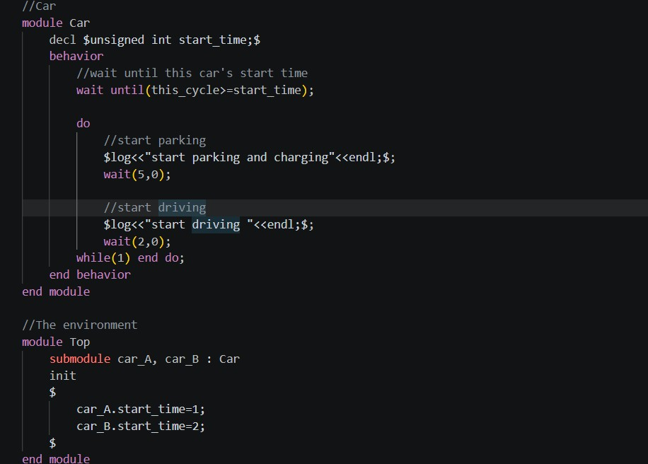

# sitar README

This is the README for extension "SitarforVScode".
Support for writing code for SITAR simulation tool in VScode.

## Installation

### Method 1: Install from VSIX

1. Download the `.vsix` file
2. Open VS Code
3. Go to Extensions panel
4. Click `...` → Install from VSIX
5. Select the file

### Method 2: CLI

code --install-extension SitarforVScode-0.0.1.vsix

## Requirements

SITAR simulation tool

## Release Notes

This is the first release.

## Author
Sharon Shibu